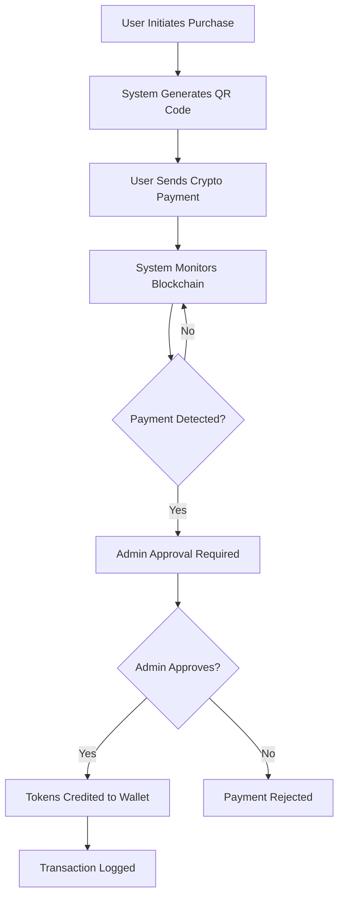
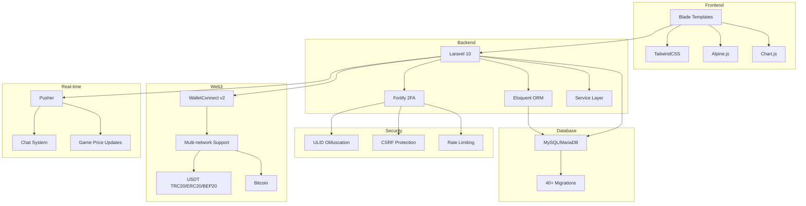

# RWAMP

<p align="center">
  
</p>

<p align="center">
  
</p>

<p align="center">
  
  
  
  
  
</p>

<p align="center">
  
  
  
  
</p>

---

## 🎯 Trust Signals

**RWAMP** is a production-ready real estate tokenization platform backed by **Mark Properties**, operating in Dubai, Pakistan, and Saudi Arabia. The platform enables secure, transparent investment in real estate assets through blockchain technology.

- ✅ **KYC-Compliant**: Full Know Your Customer verification system
- ✅ **Live Production**: Fully operational with real transactions
- ✅ **Security-First**: 2FA, ULID obfuscation, CSRF protection, rate limiting
- ✅ **Multi-Market**: Active operations in Dubai, Pakistan, Saudi Arabia
- ✅ **Reseller Program**: Live commission system with ULID: `01KBYBTN5T9WEASCFAES1N57HA`

---

## 🚀 Key Features (Live & Production-Ready)

### 🎮 Trading Game System
**Real-time price engine with PIN-protected trading sessions**

- Dynamic price calculations using Binance BTC/USD + USD/PKR rates
- Game sessions with 4-digit PIN protection and 3-attempt lockout
- Buy/sell simulation with spread, fees, and spread revenue
- Real-time price history charts (Chart.js)
- Automatic price history pruning for performance
- Game state recovery for stuck sessions

📖 **Documentation**: [`docs/features/GAME_FEATURE_IMPLEMENTATION.md`](docs/features/GAME_FEATURE_IMPLEMENTATION.md)

### 🔐 ULID-Based URL Obfuscation
**Enhanced security through non-sequential identifiers**

- Replaces numeric IDs in 5 admin route groups (`/a/p/`, `/a/u/`, `/a/ap/`, `/a/w/`, `/a/g/`)
- Prevents enumeration attacks on sensitive resources
- Shorter, user-friendly URLs (e.g., `/a/u/01KBYBTN5T9WEASCFAES1N57HA`)
- Backward compatibility with numeric ID redirects
- Automatic ULID generation via `HasUlid` trait

📖 **Documentation**: [`docs/ulid-url-obfuscation.md`](docs/ulid-url-obfuscation.md)

### 🔗 WalletConnect v2 Integration
**Mobile wallet support with deep link handling**

- MetaMask, Trust Wallet, and WalletConnect-compatible wallets
- Mobile deep link support for seamless payment returns
- Connection status polling API
- Real-time wallet connection tracking
- QR code generation for all supported networks

📖 **Documentation**: [`docs/walletconnect-troubleshooting.md`](docs/walletconnect-troubleshooting.md)

### 📊 Weighted-Average Portfolio Pricing
**Accurate profit/loss calculations**

- Weighted average purchase price tracking per user
- Real-time portfolio valuation
- Accurate profit/loss calculations
- JavaScript helper module for client-side price updates
- Enhanced `PriceHelper` service with rate caching

### 💬 WhatsApp-Style Chat System
**Real-time messaging with Pusher integration**

- Private and group chat support
- Media file sharing (images, documents)
- Voice message support
- Message reactions and read receipts
- Chat pinning, muting, and archiving
- Real-time updates via Pusher broadcasting

📖 **Documentation**: [`docs/features/CHAT_SYSTEM_IMPLEMENTATION.md`](docs/features/CHAT_SYSTEM_IMPLEMENTATION.md)

### 🤝 Live Reseller Program
**Commission-based reseller system with KYC approval**

- 10% default commission on approved payments
- 5% markup on buy-from-reseller requests
- Referral code system (RSL{id} format)
- Reseller dashboard with user management
- Payment approval workflow
- Custom coin price setting per reseller

**Status**: ✅ Approved Reseller ULID: `01KBYBTN5T9WEASCFAES1N57HA` | KYC: ✅ Verified

📖 **Documentation**: [`docs/features/RESELLER_SYSTEM_IMPLEMENTATION.md`](docs/features/RESELLER_SYSTEM_IMPLEMENTATION.md)

---

## 🛠️ Technology Stack

### Backend
- **Laravel 10.x** - PHP framework
- **PHP 8.2+** - Modern PHP features
- **MySQL/MariaDB** - Database
- **Laravel Fortify** - Authentication & 2FA
- **Laravel Sanctum** - API authentication
- **Guzzle HTTP** - API client for blockchain monitoring
- **Endroid QR Code** - QR code generation

### Frontend
- **Blade Templates** - Server-side rendering
- **TailwindCSS 3.3+** - Utility-first CSS
- **Alpine.js 3.13+** - Lightweight reactivity
- **Vite 4.0+** - Build tool
- **Chart.js 4.5.1** - Price history charts

### Web3 & Crypto
- **WalletConnect v2** - Mobile wallet connections
- **Multi-network support**: USDT (TRC20/ERC20/BEP20), Bitcoin
- **Blockchain APIs**: Etherscan, TronGrid, Alchemy, Blockstream

### Security
- **2FA (TOTP)** - Laravel Fortify
- **ULID Obfuscation** - Non-sequential identifiers
- **CSRF Protection** - Laravel built-in
- **Rate Limiting** - Login (5/min), Forms (3-6/hour)
- **Honeypot Fields** - Bot protection
- **Security Headers** - CSP, X-Frame-Options, Referrer-Policy
- **reCAPTCHA v3** - Form validation

---

## 👥 User Roles & Access

| Role | Dashboard | Key Features | Access Level |
|------|-----------|--------------|--------------|
| **Investor** | `/dashboard/investor` | Purchase tokens, view balance, transaction history, KYC submission, withdrawal requests | Standard user access |
| **Reseller** | `/dashboard/reseller` | All investor features + sell tokens, manage users, approve payments, commission tracking, custom pricing | Enhanced access with commission |
| **Admin** | `/dashboard/admin` | Full system access, user management, KYC approval, payment approval, price management, analytics | Full access (2FA required) |

### Security Requirements

- **Admin**: 2FA mandatory via Laravel Fortify TOTP
- **Reseller**: KYC approval required
- **Investor**: KYC optional (currently disabled for purchase flow)
- **All Users**: Email verification required

---

## 🚀 Quick Start (Local Development)

### Prerequisites

- PHP 8.2 or higher
- Composer 2.0+
- Node.js 16.x or higher
- MySQL 5.7+ or MariaDB
- Git

### Installation Steps

```bash
# 1. Clone the repository
git clone https://github.com/markprop/RWAMP.git
cd RWAMP

# 2. Install PHP dependencies
composer install

# 3. Install Node.js dependencies
npm install

# 4. Environment setup
cp .env.example .env
php artisan key:generate

# 5. Configure database in .env
# DB_CONNECTION=mysql
# DB_HOST=127.0.0.1
# DB_PORT=3306
# DB_DATABASE=rwamp_laravel
# DB_USERNAME=your_username
# DB_PASSWORD=your_password

# 6. Run migrations
php artisan migrate

# 7. Seed database (optional - creates admin user)
php artisan db:seed

# 8. Build assets
npm run build

# 9. Start development server
php artisan serve

# 10. In another terminal, start Vite dev server (for hot reload)
npm run dev
```

Visit `http://localhost:8000` to access the application.

### Default Admin Credentials (After Seeding)

- **Email**: `admin@rwamp.com`
- **Password**: Check `database/seeders/AdminUserSeeder.php`

**⚠️ Important**: Change default credentials immediately in production!

---

## 🔐 Security Features

### Authentication & Authorization

- **2FA (TOTP)**: Required for all admin routes via Laravel Fortify
- **Email Verification**: OTP-based verification system
- **Password Reset**: Secure token-based reset flow
- **Role-Based Access Control**: Middleware-protected routes

### URL Security

- **ULID Obfuscation**: 5 admin route groups use ULID instead of numeric IDs
  - `/a/p/{ulid}` - Crypto payments
  - `/a/u/{ulid}` - User management
  - `/a/ap/{ulid}` - Reseller applications
  - `/a/w/{ulid}` - Withdrawal requests
  - `/a/g/settings` - Game settings

### Protection Mechanisms

- **CSRF Protection**: Laravel built-in CSRF tokens on all forms
- **Rate Limiting**: 
  - Login: 5 attempts per minute
  - Forms: 3-6 attempts per hour
  - OTP verification: Custom throttling
- **Honeypot Fields**: Bot protection on contact/reseller forms
- **Security Headers**: 
  - Content-Security-Policy (CSP)
  - X-Frame-Options: DENY
  - Referrer-Policy: strict-origin-when-cross-origin
- **Input Validation**: Server-side validation on all inputs
- **SQL Injection Prevention**: Eloquent ORM parameter binding
- **XSS Protection**: Blade automatic escaping

---

## 💳 Crypto Payment System

### Supported Networks

- **USDT**: TRC20, ERC20, BEP20
- **Bitcoin**: Native Bitcoin network
- **WalletConnect v2**: All networks via mobile wallets

### Payment Flow



### Features

- ✅ Automated blockchain transaction monitoring
- ✅ QR code generation for all networks
- ✅ WalletConnect integration for mobile payments
- ✅ Multi-network support (TRC20/ERC20/BEP20/BTC)
- ✅ Manual admin approval workflow
- ✅ Transaction history tracking
- ✅ Commission calculation for resellers

---

## 📚 Documentation

All documentation is professionally organized under `/docs/`:

### Quick Links

- **📊 Project Analysis**: [`docs/analysis/PROJECT_ANALYSIS_COMPLETE.md`](docs/analysis/PROJECT_ANALYSIS_COMPLETE.md)
- **🎮 Game System**: [`docs/features/GAME_FEATURE_IMPLEMENTATION.md`](docs/features/GAME_FEATURE_IMPLEMENTATION.md)
- **🚀 Deployment**: [`docs/deployment/HOSTINGER_DEPLOYMENT_GUIDE.md`](docs/deployment/HOSTINGER_DEPLOYMENT_GUIDE.md)
- **🔐 Security**: [`docs/security.md`](docs/security.md)
- **💳 Crypto Setup**: [`docs/crypto-setup.md`](docs/crypto-setup.md)
- **🔗 WalletConnect**: [`docs/walletconnect-troubleshooting.md`](docs/walletconnect-troubleshooting.md)
- **🤝 Reseller System**: [`docs/features/RESELLER_SYSTEM_IMPLEMENTATION.md`](docs/features/RESELLER_SYSTEM_IMPLEMENTATION.md)
- **💬 Chat System**: [`docs/features/CHAT_SYSTEM_IMPLEMENTATION.md`](docs/features/CHAT_SYSTEM_IMPLEMENTATION.md)

### Documentation Structure

```
docs/
├── analysis/          # Project analysis documents
├── api/              # API documentation
├── code-quality/     # Code quality guides
├── commit-messages/  # Commit message templates
├── database/         # Database setup & migration guides
├── deployment/       # Deployment guides (Hostinger, etc.)
├── environment/      # Environment configuration
├── features/         # Feature implementation guides
├── fixes/            # Troubleshooting & fixes
├── git/              # Git workflow documentation
├── integration/      # Third-party integrations
├── refactoring/      # Refactoring guides
└── updates/          # Update & migration guides
```

See [`docs/README.md`](docs/README.md) for complete documentation index.

---

## 🗺️ Roadmap

```mermaid
gantt
    title RWAMP Development Roadmap
    dateFormat  YYYY-MM-DD
    section Core Features
    Authentication & 2FA           :done, auth, 2024-01-01, 2024-03-01
    Crypto Payment System          :done, crypto, 2024-02-01, 2024-04-01
    Reseller Program               :done, reseller, 2024-03-01, 2024-05-01
    KYC Verification               :done, kyc, 2024-04-01, 2024-06-01
    section Advanced Features
    Trading Game System            :done, game, 2024-11-01, 2025-01-27
    ULID URL Obfuscation           :done, ulid, 2024-12-01, 2025-01-27
    WalletConnect v2               :done, wallet, 2024-12-01, 2025-01-27
    Chat System                    :done, chat, 2024-12-01, 2025-01-27
    section Future Enhancements
    Mobile App                     :active, mobile, 2025-02-01, 2025-06-01
    Advanced Analytics             :future, analytics, 2025-03-01, 2025-05-01
    Multi-language Support         :future, i18n, 2025-04-01, 2025-07-01
```

---

## 🤝 Reseller Program

**Join the RWAMP Reseller Program and earn commissions on every approved transaction.**

### Benefits

- 💰 **10% Commission** on all approved crypto payments from your referred users
- 📈 **5% Markup** on buy-from-reseller requests
- 🎯 **Custom Pricing** - Set your own coin prices
- 👥 **User Management** - Manage your referred users
- 📊 **Analytics Dashboard** - Track your earnings and performance
- ✅ **KYC Verified** - Professional reseller status

### How to Apply

1. Visit [`/become-partner`](https://rwamp.net/become-partner)
2. Fill out the reseller application form
3. Complete KYC verification
4. Wait for admin approval
5. Start earning commissions!

**Already a Reseller?** [Login to Dashboard](https://rwamp.net/dashboard/reseller)

---

## 🏗️ Project Structure

```
rwamp-laravel/
├── app/
│   ├── Actions/Fortify/          # Authentication actions
│   ├── Console/Commands/          # Artisan commands
│   ├── Http/
│   │   ├── Controllers/          # Application controllers
│   │   │   ├── Admin/           # Admin controllers
│   │   │   ├── Investor/        # Investor controllers
│   │   │   ├── Reseller/        # Reseller controllers
│   │   │   └── GameController.php
│   │   └── Middleware/          # Custom middleware
│   ├── Models/                   # Eloquent models
│   ├── Services/                 # Business logic services
│   └── Concerns/                 # Traits (HasUlid, etc.)
├── config/                       # Configuration files
├── database/
│   ├── migrations/               # Database migrations
│   └── seeders/                  # Database seeders
├── docs/                         # Professional documentation
├── public/                       # Public assets
├── resources/
│   ├── css/                      # Stylesheets
│   ├── js/                       # JavaScript files
│   └── views/                    # Blade templates
│       ├── auth/                 # Authentication views
│       ├── components/           # Reusable components
│       ├── dashboard/            # Role-specific dashboards
│       ├── game/                # Game system views
│       └── pages/               # Public pages
├── routes/                       # Route definitions
└── storage/                      # Storage files
```

---

## 🚀 Deployment

### Hostinger Shared Hosting

Complete deployment guide available: [`docs/deployment/HOSTINGER_DEPLOYMENT_GUIDE.md`](docs/deployment/HOSTINGER_DEPLOYMENT_GUIDE.md)

### Quick Deployment Checklist

- [ ] Build production assets: `npm run build`
- [ ] Optimize Laravel: `php artisan optimize`
- [ ] Set `APP_ENV=production` and `APP_DEBUG=false`
- [ ] Configure production database
- [ ] Setup SSL certificate
- [ ] Configure mail settings
- [ ] Run migrations: `php artisan migrate`
- [ ] Create storage symlink: `php artisan storage:link`
- [ ] Setup cron jobs for scheduled tasks
- [ ] Configure queue workers (if using queues)

---

## 🔧 Development Commands

### Development

```bash
npm run dev          # Start Vite dev server (hot reload)
php artisan serve    # Start Laravel development server
```

### Production

```bash
npm run build        # Build assets for production
php artisan optimize # Optimize for production
```

### Database

```bash
php artisan migrate        # Run migrations
php artisan migrate:fresh   # Fresh migration (drops all tables)
php artisan db:seed        # Run seeders
```

### Maintenance

```bash
php artisan cache:clear    # Clear application cache
php artisan config:clear   # Clear configuration cache
php artisan view:clear     # Clear compiled views
php artisan route:clear    # Clear route cache
```

### Game System Commands

```bash
php artisan game:prune-history    # Prune old price history
php artisan game:reset-stuck      # Reset stuck game sessions
php artisan crypto:monitor        # Monitor crypto payments
php artisan wallet:generate       # Generate missing wallets
```

---

## 📊 System Architecture



---

## 🆘 Support

### Contact Information

- **Website**: [rwamp.net](https://rwamp.net)
- **Email**: info@rwamp.net
- **Support**: Available through dashboard chat system

### Documentation

- **Full Documentation**: [`docs/README.md`](docs/README.md)
- **Troubleshooting**: [`docs/fixes/`](docs/fixes/)
- **API Reference**: [`docs/api/API_DOCUMENTATION.md`](docs/api/API_DOCUMENTATION.md)

---

## 📄 License

This project is **proprietary software** owned by **RWAMP** and backed by **Mark Properties**.

**All rights reserved. © 2025 RWAMP**

---

## ⭐ Star History

[](https://star-history.com/#markprop/RWAMP&Date)

---

<p align="center">
  <strong>Made with ❤️ by the RWAMP Team</strong>
</p>

<p align="center">
  <a href="#rwamp">⬆ Back to Top</a>
</p>
