<!-- RWAMP - The Currency of Real Estate Investments -->
<!-- Production README - Last Updated: January 27, 2025 -->

<p align="center">
  
</p>

<p align="center">
  <a href="https://rwamp.io">
    
  </a>
</p>

<p align="center">
  
</p>

<p align="center">
  
</p>

<p align="center">
  
</p>

<p align="center">
  
</p>

<p align="center">
  
</p>

---

<p align="center">
  
  
  
  
</p>

<p align="center">
  
  
  
  
  
  
</p>

---

## 🎯 What is RWAMP?

**RWAMP** is a production-ready real estate tokenization platform that enables secure, transparent investment in real estate assets across **Dubai, Pakistan, and Saudi Arabia**. Built on Laravel 10 with Web3 integration, RWAMP combines traditional real estate investment with blockchain technology.

**Key Differentiators:**
- 🏗️ **Live Production System** — Fully operational with real transactions
- 🔐 **Enterprise Security** — 2FA, ULID obfuscation, CSRF protection
- 🌍 **Multi-Market Presence** — Active operations in three countries
- 🤝 **Reseller Network** — Commission-based partner program
- 💎 **KYC-Compliant** — Full regulatory compliance

---

## ✨ Live Features (Production-Ready)

| Feature | Status | Description | Documentation |
|---------|--------|-------------|---------------|
| 🎮 **Trading Game System** | ✅ Live | Real-time price engine, PIN-protected sessions, buy/sell simulation | [`docs/features/GAME_FEATURE_IMPLEMENTATION.md`](docs/features/GAME_FEATURE_IMPLEMENTATION.md) |
| 🔐 **ULID URL Obfuscation** | ✅ Live | 5 admin route groups secured with non-sequential identifiers | [`docs/ulid-url-obfuscation.md`](docs/ulid-url-obfuscation.md) |
| 🔗 **WalletConnect v2** | ✅ Live | Mobile wallet support (MetaMask, Trust Wallet) with deep linking | [`docs/walletconnect-troubleshooting.md`](docs/walletconnect-troubleshooting.md) |
| 📊 **Weighted-Average Pricing** | ✅ Live | Accurate portfolio valuation with profit/loss calculations | [`docs/features/`](docs/features/) |
| 💬 **WhatsApp-Style Chat** | ✅ Live | Real-time messaging, media sharing, groups (Pusher-powered) | [`docs/features/CHAT_SYSTEM_IMPLEMENTATION.md`](docs/features/CHAT_SYSTEM_IMPLEMENTATION.md) |
| 🤝 **Reseller Program** | ✅ Live | 10% commission, KYC-approved, custom pricing | [`docs/features/RESELLER_SYSTEM_IMPLEMENTATION.md`](docs/features/RESELLER_SYSTEM_IMPLEMENTATION.md) |
| 💳 **Crypto Payments** | ✅ Live | USDT (TRC20/ERC20/BEP20), Bitcoin, automated monitoring | [`docs/crypto-setup.md`](docs/crypto-setup.md) |
| 🆔 **KYC Verification** | ✅ Live | Document upload, admin approval workflow | [`docs/security.md`](docs/security.md) |
| 🔒 **2FA Authentication** | ✅ Live | TOTP-based 2FA for admin users (Laravel Fortify) | [`docs/admin-2fa.md`](docs/admin-2fa.md) |

---

## 🏗️ System Architecture

```mermaid
graph TD
    A[🌐 Frontend Layer] --> B[Blade Templates]
    A --> C[TailwindCSS + Alpine.js]
    A --> D[Chart.js]
    
    B --> E[⚙️ Backend Layer]
    C --> E
    D --> E
    
    E --> F[Laravel 10 Framework]
    F --> G[Fortify 2FA]
    F --> H[Eloquent ORM]
    F --> I[Service Layer]
    
    G --> J[🔐 Security Layer]
    H --> J
    I --> J
    
    J --> K[ULID Obfuscation]
    J --> L[CSRF Protection]
    J --> M[Rate Limiting]
    
    F --> N[🌍 Web3 Layer]
    N --> O[WalletConnect v2]
    N --> P[Multi-network Support]
    P --> Q[USDT TRC20/ERC20/BEP20]
    P --> R[Bitcoin Network]
    
    F --> S[💬 Real-time Layer]
    S --> T[Pusher Broadcasting]
    T --> U[Chat System]
    T --> V[Game Price Updates]
    
    F --> W[💾 Database Layer]
    W --> X[MySQL/MariaDB]
    X --> Y[40+ Migrations]
    X --> Z[Game Sessions]
    X --> AA[Chat Messages]
    
    style A fill:#FF6B6B,stroke:#fff,stroke-width:2px,color:#fff
    style E fill:#06D6A0,stroke:#fff,stroke-width:2px,color:#fff
    style J fill:#118AB2,stroke:#fff,stroke-width:2px,color:#fff
    style N fill:#3B99FC,stroke:#fff,stroke-width:2px,color:#fff
    style S fill:#FF6B6B,stroke:#fff,stroke-width:2px,color:#fff
    style W fill:#06D6A0,stroke:#fff,stroke-width:2px,color:#fff
```



---

## 🤝 Reseller Program Spotlight

<!-- RESELLER SPOTLIGHT -->

<p align="center">

### 🎖️ Approved Reseller Status

| **Reseller ULID** | **KYC Status** | **Commission Rate** | **Markup** | **Status** |
|-------------------|----------------|---------------------|------------|------------|
| `01KBYBTN5T9WEASCFAES1N57HA` | ✅ Verified | 10% on approved payments | 5% on buy requests | 🟢 Active |

**Benefits:**
- 💰 **10% Commission** on all approved crypto payments from referred users
- 📈 **5% Markup** on buy-from-reseller requests
- 🎯 **Custom Pricing** — Set your own coin prices
- 👥 **User Management** — Manage your referred users
- 📊 **Analytics Dashboard** — Track earnings and performance
- ✅ **KYC Verified** — Professional reseller status

**Apply Now:** [Become a Reseller](https://rwamp.io/become-partner) | **Login:** [Reseller Dashboard](https://rwamp.io/dashboard/reseller)

</p>

---

## 🗺️ Development Roadmap

```mermaid
gantt
    title RWAMP Development Roadmap
    dateFormat YYYY-MM-DD
    section Core Infrastructure
    Authentication and 2FA :done, auth, 2024-01-01, 2024-03-01
    Crypto Payment System :done, crypto, 2024-02-01, 2024-04-01
    Reseller Program :done, reseller, 2024-03-01, 2024-05-01
    KYC Verification :done, kyc, 2024-04-01, 2024-06-01
    section Advanced Features
    Trading Game System :done, game, 2024-11-01, 2025-01-27
    ULID URL Obfuscation :done, ulid, 2024-12-01, 2025-01-27
    WalletConnect v2 :done, wallet, 2024-12-01, 2025-01-27
    Chat System :done, chat, 2024-12-01, 2025-01-27
    Weighted Average Pricing :done, pricing, 2025-01-01, 2025-01-27
    section Future Enhancements
    Mobile Application :active, mobile, 2025-02-01, 2025-06-01
    Advanced Analytics :future, analytics, 2025-03-01, 2025-05-01
    Multi-language Support :future, i18n, 2025-04-01, 2025-07-01
    API v2 :future, api2, 2025-05-01, 2025-08-01
```

---

## 🚀 Quick Start

### Prerequisites

- PHP 8.2 or higher
- Composer 2.0+
- Node.js 16.x or higher
- MySQL 5.7+ or MariaDB
- Git

### Installation

```bash
# Clone the repository
git clone https://github.com/markprop/RWAMP.git
cd RWAMP

# Install PHP dependencies
composer install

# Install Node.js dependencies
npm install

# Environment setup
cp .env.example .env
php artisan key:generate

# Configure database in .env
# DB_CONNECTION=mysql
# DB_HOST=127.0.0.1
# DB_PORT=3306
# DB_DATABASE=rwamp_laravel
# DB_USERNAME=your_username
# DB_PASSWORD=your_password

# Run migrations
php artisan migrate

# Seed database (optional - creates admin user)
php artisan db:seed

# Build assets
npm run build

# Start development server
php artisan serve

# In another terminal, start Vite dev server (for hot reload)
npm run dev
```

Visit `http://localhost:8000` to access the application.

---

## 🔐 Security Features

### Authentication & Authorization

- **2FA (TOTP)**: Required for all admin routes via Laravel Fortify
- **Email Verification**: OTP-based verification system
- **Password Reset**: Secure token-based reset flow
- **Role-Based Access Control**: Middleware-protected routes

### URL Security (ULID Obfuscation)

- **5 Admin Route Groups** use ULID instead of numeric IDs:
  - `/a/p/{ulid}` — Crypto payments
  - `/a/u/{ulid}` — User management
  - `/a/ap/{ulid}` — Reseller applications
  - `/a/w/{ulid}` — Withdrawal requests
  - `/a/g/settings` — Game settings

### Protection Mechanisms

- **CSRF Protection**: Laravel built-in CSRF tokens on all forms
- **Rate Limiting**: 
  - Login: 5 attempts per minute
  - Forms: 3-6 attempts per hour
  - OTP verification: Custom throttling
- **Honeypot Fields**: Bot protection on contact/reseller forms
- **Security Headers**: 
  - Content-Security-Policy (CSP)
  - X-Frame-Options: DENY
  - Referrer-Policy: strict-origin-when-cross-origin
- **Input Validation**: Server-side validation on all inputs
- **SQL Injection Prevention**: Eloquent ORM parameter binding
- **XSS Protection**: Blade automatic escaping

---

## 👥 User Roles & Access

| Role | Dashboard | Key Features | Security Requirements |
|------|-----------|--------------|----------------------|
| **Investor** | `/dashboard/investor` | Purchase tokens, view balance, transaction history, KYC submission, withdrawal requests | Email verification |
| **Reseller** | `/dashboard/reseller` | All investor features + sell tokens, manage users, approve payments, commission tracking, custom pricing | KYC approval required |
| **Admin** | `/dashboard/admin` | Full system access, user management, KYC approval, payment approval, price management, analytics | 2FA mandatory |

---

## 💳 Crypto Payment Flow

```mermaid
graph LR
    A[👤 User Initiates Purchase] --> B[📱 QR Code Generated]
    B --> C[💸 User Sends Crypto]
    C --> D[🔍 Blockchain Monitoring]
    D --> E{Payment Detected?}
    E -->|Yes| F[👨‍💼 Admin Approval]
    E -->|No| D
    F --> G{Approved?}
    G -->|Yes| H[✅ Tokens Credited]
    G -->|No| I[❌ Payment Rejected]
    H --> J[📊 Transaction Logged]
    H --> K[💰 Reseller Commission]
    
    style A fill:#FF6B6B,stroke:#fff,stroke-width:2px,color:#fff
    style B fill:#06D6A0,stroke:#fff,stroke-width:2px,color:#fff
    style C fill:#118AB2,stroke:#fff,stroke-width:2px,color:#fff
    style F fill:#FF6B6B,stroke:#fff,stroke-width:2px,color:#fff
    style H fill:#06D6A0,stroke:#fff,stroke-width:2px,color:#fff
    style K fill:#118AB2,stroke:#fff,stroke-width:2px,color:#fff
```



### Supported Networks

- **USDT**: TRC20, ERC20, BEP20
- **Bitcoin**: Native Bitcoin network
- **WalletConnect v2**: All networks via mobile wallets (MetaMask, Trust Wallet)

---

## 📚 Documentation

All documentation is professionally organized under `/docs/`:

### Quick Links

- **📊 Project Analysis**: [`docs/analysis/PROJECT_ANALYSIS_COMPLETE.md`](docs/analysis/PROJECT_ANALYSIS_COMPLETE.md)
- **🎮 Game System**: [`docs/features/GAME_FEATURE_IMPLEMENTATION.md`](docs/features/GAME_FEATURE_IMPLEMENTATION.md)
- **🚀 Deployment**: [`docs/deployment/HOSTINGER_DEPLOYMENT_GUIDE.md`](docs/deployment/HOSTINGER_DEPLOYMENT_GUIDE.md)
- **🔐 Security**: [`docs/security.md`](docs/security.md)
- **💳 Crypto Setup**: [`docs/crypto-setup.md`](docs/crypto-setup.md)
- **🔗 WalletConnect**: [`docs/walletconnect-troubleshooting.md`](docs/walletconnect-troubleshooting.md)
- **🤝 Reseller System**: [`docs/features/RESELLER_SYSTEM_IMPLEMENTATION.md`](docs/features/RESELLER_SYSTEM_IMPLEMENTATION.md)
- **💬 Chat System**: [`docs/features/CHAT_SYSTEM_IMPLEMENTATION.md`](docs/features/CHAT_SYSTEM_IMPLEMENTATION.md)

### Documentation Structure

```
docs/
├── analysis/          # Project analysis documents
├── api/              # API documentation
├── code-quality/     # Code quality guides
├── commit-messages/  # Commit message templates
├── database/         # Database setup & migration guides
├── deployment/       # Deployment guides (Hostinger, etc.)
├── environment/      # Environment configuration
├── features/         # Feature implementation guides
├── fixes/            # Troubleshooting & fixes
├── git/              # Git workflow documentation
├── integration/      # Third-party integrations
├── refactoring/      # Refactoring guides
└── updates/          # Update & migration guides
```

See [`docs/README.md`](docs/README.md) for complete documentation index.

---

## 🛠️ Technology Stack

### Backend
- **Laravel 10.x** — PHP framework
- **PHP 8.2+** — Modern PHP features
- **MySQL/MariaDB** — Database
- **Laravel Fortify** — Authentication & 2FA
- **Laravel Sanctum** — API authentication
- **Guzzle HTTP** — API client for blockchain monitoring
- **Endroid QR Code** — QR code generation

### Frontend
- **Blade Templates** — Server-side rendering
- **TailwindCSS 3.3+** — Utility-first CSS
- **Alpine.js 3.13+** — Lightweight reactivity
- **Vite 4.0+** — Build tool
- **Chart.js 4.5.1** — Price history charts

### Web3 & Crypto
- **WalletConnect v2** — Mobile wallet connections
- **Multi-network support**: USDT (TRC20/ERC20/BEP20), Bitcoin
- **Blockchain APIs**: Etherscan, TronGrid, Alchemy, Blockstream

---

## 🔧 Development Commands

### Development

```bash
npm run dev          # Start Vite dev server (hot reload)
php artisan serve    # Start Laravel development server
```

### Production

```bash
npm run build        # Build assets for production
php artisan optimize # Optimize for production
```

### Database

```bash
php artisan migrate        # Run migrations
php artisan migrate:fresh   # Fresh migration (drops all tables)
php artisan db:seed        # Run seeders
```

### Maintenance

```bash
php artisan cache:clear    # Clear application cache
php artisan config:clear   # Clear configuration cache
php artisan view:clear     # Clear compiled views
php artisan route:clear    # Clear route cache
```

### Game System Commands

```bash
php artisan game:prune-history    # Prune old price history
php artisan game:reset-stuck      # Reset stuck game sessions
php artisan crypto:monitor        # Monitor crypto payments
php artisan wallet:generate       # Generate missing wallets
```

---

## 🚀 Deployment

### Hostinger Shared Hosting

Complete deployment guide available: [`docs/deployment/HOSTINGER_DEPLOYMENT_GUIDE.md`](docs/deployment/HOSTINGER_DEPLOYMENT_GUIDE.md)

### Quick Deployment Checklist

- [ ] Build production assets: `npm run build`
- [ ] Optimize Laravel: `php artisan optimize`
- [ ] Set `APP_ENV=production` and `APP_DEBUG=false`
- [ ] Configure production database
- [ ] Setup SSL certificate
- [ ] Configure mail settings
- [ ] Run migrations: `php artisan migrate`
- [ ] Create storage symlink: `php artisan storage:link`
- [ ] Setup cron jobs for scheduled tasks
- [ ] Configure queue workers (if using queues)

---

## 🆘 Support

### Contact Information

- **Website**: [rwamp.io](https://rwamp.io)
- **Email**: info@rwamp.net
- **Phone**: +92 370 1346038
- **Support**: Available through dashboard chat system

### Documentation

- **Full Documentation**: [`docs/README.md`](docs/README.md)
- **Troubleshooting**: [`docs/fixes/`](docs/fixes/)
- **API Reference**: [`docs/api/API_DOCUMENTATION.md`](docs/api/API_DOCUMENTATION.md)

---

## 📄 License

This project is **proprietary software** owned by **RWAMP** and backed by **Mark Properties**.

**All rights reserved. © 2025 RWAMP**

---

## ⭐ Star History

[](https://star-history.com/#markprop/RWAMP&Date)

---

<p align="center">
  
</p>

<p align="center">
  <a href="https://rwamp.io">
    
  </a>
</p>

<p align="center">
  <strong>Made with ❤️ by the RWAMP Team</strong>
</p>

---

## 🔙 Navigation

<p align="center">
  <a href="#rwamp">
    
  </a>
  <a href="docs/README.md">
    
  </a>
  <a href="https://rwamp.io">
    
  </a>
</p>

<p align="center">
  <strong>Made with ❤️ by the RWAMP Team</strong>
</p>
